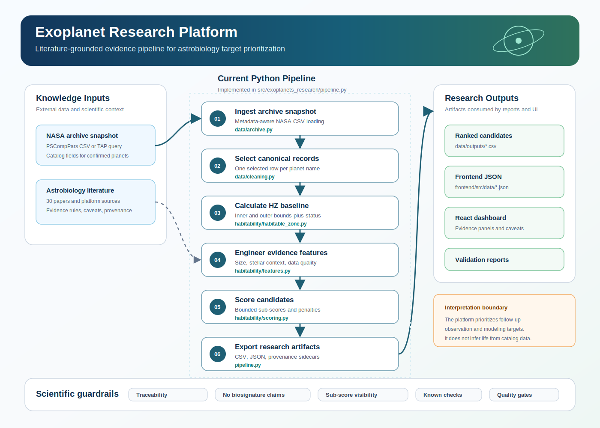

# Exoplanet Research Platform

[](https://www.python.org/)
[](https://exoplanetarchive.ipac.caltech.edu/)
[](https://pandas.pydata.org/)
[](https://react.dev/)
[](https://vite.dev/)
[](https://docs.pytest.org/)

Exoplanet Research Platform is a literature-grounded astrobiology and exobiology research system for ranking confirmed exoplanets as follow-up candidates for observation, modeling, and mission planning. It combines NASA Exoplanet Archive data, a curated astrobiology paper and platform registry, reproducible scoring, provenance sidecars, validation reports, and a React dashboard.

The project is designed as a scientific software artifact: the focus is not only producing a ranked list, but exposing evidence components, uncertainty, missing-data penalties, literature traceability, conservative interpretation, and reproducible validation gates.

## Contents

- [What This Project Is](#what-this-project-is)
- [Architecture](#architecture)
- [Scientific Workflow](#scientific-workflow)
- [Scientific Design](#scientific-design)
- [Technology Stack](#technology-stack)
- [Project Structure](#project-structure)
- [Quick Start](#quick-start)
- [Usage](#usage)
- [Evaluation and Research](#evaluation-and-research)
- [Reproducibility and Provenance](#reproducibility-and-provenance)
- [Paper Reproduction](#paper-reproduction)
- [License](#license)

## What This Project Is

This repository implements an astrobiology target-prioritization platform over confirmed exoplanet catalog data. The core workload is scientifically constrained candidate ranking: de-duplicating archive records, calculating a baseline habitable-zone estimate, engineering observability and data-quality features, scoring candidates with explicit sub-scores, and presenting results with caveats.

The system intentionally separates:

- **Archive ingestion** from downstream scoring.
- **Canonical record selection** from raw catalog snapshots.
- **Habitable-zone calculation** from broader climate interpretation.
- **Feature engineering** from score weighting.
- **Candidate ranking** from biosignature inference.
- **Literature traceability** from UI presentation.
- **Validation** from generated research artifacts.

Supported interfaces and artifacts:

- Python package and CLI pipeline.
- Machine-readable literature registry.
- CSV and JSON data products.
- Provenance sidecars for generated outputs.
- React/Vite dashboard for ranked candidates and evidence breakdowns.
- Architecture, literature, and validation reports under `docs/`.

## Architecture

The platform is organized as a reproducible evidence pipeline with a lightweight research dashboard:



The architecture is composed of:

- **Archive ingestion**: reads NASA Exoplanet Archive planetary systems CSV snapshots, including archive metadata rows.
- **Record cleaning**: collapses duplicate planet entries and selects one canonical row per `pl_name`.
- **Literature registry**: stores papers, platforms, research implications, and architecture links in YAML.
- **Habitable-zone baseline**: computes reproducible inner and outer HZ bounds from stellar luminosity.
- **Evidence scoring**: combines HZ position, planet size, stellar context, data quality, follow-up readiness, and missing-data penalties.
- **Validation suite**: checks formula parity, registry schema, candidate survival, scoring bounds, and generated artifacts.
- **Dashboard**: renders ranked candidates, score decomposition, caveats, and literature traceability.

## Scientific Workflow

The pipeline entry point is [`src/exoplanets_research/pipeline.py`](src/exoplanets_research/pipeline.py). The main path is:

1. **Load Archive Snapshot**
   - Implemented in [`src/exoplanets_research/data/archive.py`](src/exoplanets_research/data/archive.py).
   - Reads the local NASA Exoplanet Archive CSV and supports the PSCompPars TAP query template.

2. **Select Canonical Records**
   - Implemented in [`src/exoplanets_research/data/cleaning.py`](src/exoplanets_research/data/cleaning.py).
   - Prefers `default_flag == 1`, then records with the most complete critical fields.

3. **Calculate Habitable-Zone Baseline**
   - Implemented in [`src/exoplanets_research/habitability/habitable_zone.py`](src/exoplanets_research/habitability/habitable_zone.py).
   - Produces `hz_inner`, `hz_outer`, `hz_model`, and `habitable_zone_status`.

4. **Engineer Scientific Features**
   - Implemented in [`src/exoplanets_research/habitability/features.py`](src/exoplanets_research/habitability/features.py).
   - Adds radius class, stellar-temperature class, HZ center offset, data-quality signals, follow-up readiness, and missing critical fields.

5. **Score Candidates**
   - Implemented in [`src/exoplanets_research/habitability/scoring.py`](src/exoplanets_research/habitability/scoring.py).
   - Exposes sub-scores, total score, confidence label, interpretation label, and a conservative caveat.

6. **Export Research Artifacts**
   - Writes canonical, HZ, ranked, provenance, and dashboard-ready files under `data/`.
   - Keeps generated outputs inspectable by both tests and the frontend.

7. **Render Evidence**
   - The React dashboard reads [`frontend/src/data/astrobiology_ranked_candidates.json`](frontend/src/data/astrobiology_ranked_candidates.json).
   - UI components expose score breakdowns and literature-to-architecture traceability.

## Scientific Design

The publishable method target is defined in [Scientific Method Contract](docs/research/scientific_method_contract.md).

### Literature-Grounded Evidence

The registry in [`data/literature/astrobiology_sources.yml`](data/literature/astrobiology_sources.yml) currently tracks 30 sources across classical exobiology, modern biosignature assessment, life-detection frameworks, and astrobiology data/platform patterns.

The review in [`docs/research/astrobiology_literature_review.md`](docs/research/astrobiology_literature_review.md) maps those sources into architectural rules: evidence decomposition, provenance, false-positive caution, staged confidence, model extensibility, and conservative language.

### Conservative Interpretation

The platform ranks follow-up candidates. It does not infer life, atmospheric disequilibrium, or biosignatures from catalog-only data. Every ranked row carries an interpretation caveat, and validation includes an overclaim language check.

### Evidence Decomposition

Ranking is intentionally decomposed rather than hidden behind one opaque number:

- `score_hz_position`
- `score_planet_size`
- `score_stellar_context`
- `score_data_quality`
- `score_followup_readiness`
- `penalty_missing_data`
- `score_total`
- `evidence_confidence`

This makes the output useful for scientific review, error analysis, and future model replacement.

### Platform Extensibility

The architecture is designed so stronger astrobiology evidence can be added without rewriting the system:

- Stellar activity and flare proxies.
- Atmospheric retrieval availability.
- VPL-compatible spectral model hooks.
- EMAC-style model registry integration.
- LDKB-style evidence and counter-evidence arguments.
- Alternative HZ and climate-model families.

## Technology Stack

Version constraints are defined in [`pyproject.toml`](pyproject.toml) and [`frontend/package.json`](frontend/package.json).

| Layer | Technology | Version / Constraint | Role |
|---|---|---:|---|
| Language | Python | `>=3.11` | Scientific pipeline and validation |
| Dataframe runtime | pandas | project dependency | Archive ingestion, cleaning, scoring, export |
| Numerical runtime | NumPy | project dependency | Feature and score calculations |
| Literature registry | PyYAML | project dependency | Paper and platform metadata |
| Visualization scripts | matplotlib, seaborn | project dependencies | Exploratory analysis figures |
| Data source | NASA Exoplanet Archive | local CSV snapshot | Confirmed exoplanet catalog data |
| Frontend runtime | Node.js | local environment | Dashboard development and build |
| Web app | React | `^19.1.0` | Interactive dashboard |
| Build tool | Vite | `^7.0.0` | Frontend dev server and production build |
| Charts | Recharts | `^3.0.2` | Dashboard chart components |
| Tests | pytest | dev dependency | Unit and pipeline validation |

## Project Structure

```bash
exoplanets_research/
├── src/
│   ├── exoplanets_research/
│   │   ├── data/
│   │   │   ├── archive.py              # NASA archive CSV/TAP helpers
│   │   │   └── cleaning.py             # Canonical record selection
│   │   ├── habitability/
│   │   │   ├── habitable_zone.py       # Baseline HZ calculation
│   │   │   ├── features.py             # Candidate feature engineering
│   │   │   └── scoring.py              # Evidence-weighted ranking
│   │   ├── literature/
│   │   │   ├── catalog.py              # Literature registry loader
│   │   │   └── schema.py               # Source metadata schema checks
│   │   ├── validation/
│   │   │   └── gold_standards.py       # Known-candidate checks
│   │   ├── config.py                   # Stable project paths
│   │   └── pipeline.py                 # CLI and orchestration
│   ├── 01_initial_exploration.py       # Earlier exploratory analysis
│   ├── 02_exploratory_analysis.py
│   ├── 02_preprocessing.py
│   ├── 03_habitability_analysis.py
│   ├── 04_habitable_planet_analysis.py
│   └── 05_habitability_scoring.py
├── data/
│   ├── literature/
│   │   └── astrobiology_sources.yml    # Papers and platform registry
│   ├── processed/                      # Canonical and HZ outputs
│   ├── outputs/                        # Ranked candidate outputs
│   └── PS_2025.06.22_09.41.26.csv      # Local NASA archive snapshot
├── docs/
│   ├── architecture/                   # Scientific platform architecture
│   ├── research/                       # Literature review
│   ├── validation/                     # Validation reports and inventory
│   └── superpowers/plans/              # Implementation plan
├── frontend/
│   ├── src/
│   │   ├── components/                 # Dashboard evidence components
│   │   └── data/                       # Generated dashboard JSON
│   ├── package.json
│   └── vite.config.js
├── tests/                              # Unit and pipeline tests
├── reports/figures/                    # Exploratory figures
├── pyproject.toml
└── README.md
```

## Quick Start

### Prerequisites

- Python 3.11 or higher.
- Node.js `^20.19.0` or `>=22.12.0` for the dashboard, matching Vite 7.
- A local NASA Exoplanet Archive CSV snapshot. The current repository includes `data/PS_2025.06.22_09.41.26.csv`.

### 1. Clone the Repository

```bash
git clone https://github.com/MaiconKevyn/exoplanet-research.git
cd exoplanet-research
```

### 2. Install Python Requirements

Recommended local virtual environment:

```bash
python -m venv .venv
.venv/bin/python -m pip install -e ".[dev]"
```

If the virtual environment is already active, the equivalent command is:

```bash
pip install -e ".[dev]"
```

### 3. Run the Scientific Pipeline

Run every stage and refresh generated artifacts:

```bash
.venv/bin/python -m exoplanets_research.pipeline \
  --stage all \
  --input data/PS_2025.06.22_09.41.26.csv
```

Expected primary outputs:

- `data/processed/canonical_exoplanets.csv`
- `data/processed/habitable_zone_exoplanets.csv`
- `data/outputs/astrobiology_ranked_candidates.csv`
- `frontend/src/data/astrobiology_ranked_candidates.json`

### 4. Start the Dashboard

Install frontend dependencies and start Vite:

```bash
npm --prefix frontend install
npm --prefix frontend run dev
```

Open the URL printed by Vite, usually `http://localhost:5173`.

### 5. Build the Dashboard

```bash
npm --prefix frontend run build
```

## Usage

### Pipeline Stages

| Stage | Command | Purpose |
|---|---|---|
| `literature` | `.venv/bin/python -m exoplanets_research.pipeline --stage literature` | Validate the literature registry can load. |
| `canonical` | `.venv/bin/python -m exoplanets_research.pipeline --stage canonical` | Generate one canonical row per planet. |
| `score` | `.venv/bin/python -m exoplanets_research.pipeline --stage score` | Generate HZ, features, ranked candidates, and frontend JSON. |
| `export-frontend` | `.venv/bin/python -m exoplanets_research.pipeline --stage export-frontend` | Refresh the dashboard JSON through the scoring path. |
| `all` | `.venv/bin/python -m exoplanets_research.pipeline --stage all` | Run the complete artifact generation path. |

### Local Quality Checks

Run the Python validation suite:

```bash
.venv/bin/python -m pytest -q
```

Run the frontend production build:

```bash
npm --prefix frontend run build
```

Check for unsafe scientific overclaims in implementation and docs:

```bash
rg -n "life[ ]found|alien[ ]life|proof[ ]of[ ]life|confirmed[ ]life|biosignature[ ]detected" docs frontend/src src
```

### Key Data Products

| Artifact | Role |
|---|---|
| `data/processed/canonical_exoplanets.csv` | De-duplicated catalog view with one selected row per `pl_name`. |
| `data/processed/habitable_zone_exoplanets.csv` | Canonical rows with HZ bounds and HZ status. |
| `data/outputs/astrobiology_ranked_candidates.csv` | Ranked candidates with sub-scores, penalties, confidence, and caveats. |
| `data/outputs/astrobiology_ranked_candidates.provenance.json` | Provenance metadata for the ranked output. |
| `frontend/src/data/astrobiology_ranked_candidates.json` | Dashboard-ready export of ranked candidates. |

## Evaluation and Research

The validation system is designed for scientific error analysis, not only software correctness.

### Current Validation Gate

| Check | Purpose |
|---|---|
| Literature registry schema | Ensures every source has the required metadata and architecture implication. |
| HZ formula parity | Preserves reproducibility against the earlier generated HZ artifact. |
| Duplicate policy | Confirms canonical selection prefers default archive rows and completeness. |
| Scoring bounds | Ensures sub-scores and total scores remain bounded and inspectable. |
| Known-candidate survival | Confirms scientifically important candidates remain present after processing. |
| Pipeline artifacts | Confirms generated CSV, JSON, and provenance files exist and are readable. |
| Conservative language | Prevents catalog-only outputs from becoming biosignature claims. |

### Current Top Ranked Candidates

The latest validated run produced the following leading candidates:

| Rank | Planet | Host | Total score | Confidence |
|---:|---|---|---:|---|
| 1 | Kepler-442 b | Kepler-442 | 0.815 | limited_catalog_confidence |
| 2 | LP 890-9 c | LP 890-9 | 0.793 | moderate_catalog_confidence |
| 3 | TRAPPIST-1 e | TRAPPIST-1 | 0.761 | moderate_catalog_confidence |
| 4 | TOI-700 d | TOI-700 | 0.742 | limited_catalog_confidence |
| 5 | Kepler-705 b | Kepler-705 | 0.725 | limited_catalog_confidence |

Interpret these as follow-up priorities, not detections.

### Research Artifacts

- [Scientific platform architecture](docs/architecture/scientific_platform_architecture.md)
- [Astrobiology literature review](docs/research/astrobiology_literature_review.md)
- [Baseline inventory](docs/validation/baseline_inventory.md)
- [Validation report](docs/validation/validation_report.md)
- [Implementation plan](docs/superpowers/plans/2026-05-20-astrobiology-research-platform.md)

### Scientific Limitations

- The HZ calculation is a reproducibility baseline, not a full climate model.
- Catalog fields cannot establish atmospheric composition, disequilibrium, or life-detection evidence.
- Stellar activity, flare history, atmospheric escape, photochemistry, and false positives remain future evidence classes.
- Static dashboard JSON is simple and reproducible, but a larger deployment should lazy-load candidate data.

## Reproducibility and Provenance

Generated artifacts include provenance sidecars that record input file, row count, pipeline stage, generator, and UTC timestamp. The validation report in [`docs/validation/validation_report.md`](docs/validation/validation_report.md) records the tested commands, output row counts, top-ranked candidates, known-candidate checks, and frontend build status.

The current implementation has scientific impact as a transparent evidence-accounting layer over the NASA Exoplanet Archive. It provides a reproducible bridge between modern astrobiology literature and practical target prioritization for future observation and modeling work.

## Paper Reproduction

The paper-grade experiment package can be regenerated with:

```bash
paper/reproduce.sh
```

## License

This repository is distributed under the MIT License. See [LICENSE](LICENSE).
